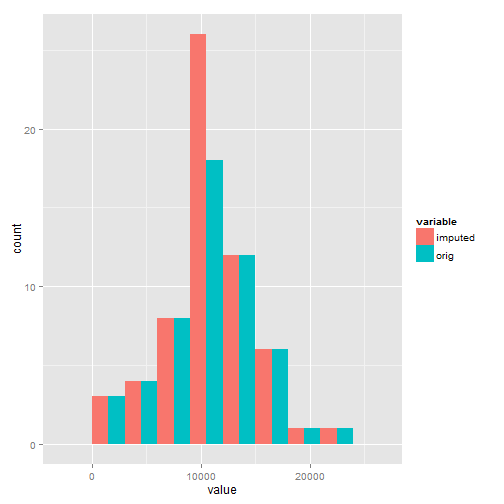
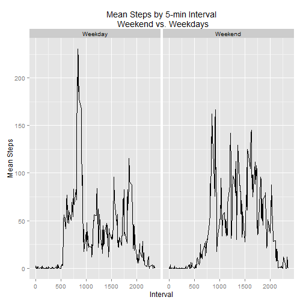

##Introduction
Personal activity monitoring devices allow users to collect a large amount of data about themselves. In this report, we will analyze of set of such data.  
The data used in this report was obtained <a href="https://d396qusza40orc.cloudfront.net/repdata%2Fdata%2Factivity.zip">here (link is to zip file).</a>  


##Load and Process Data 
First, we need to load and read in the data. We can see that the data consists of three variables, "steps", "date", and "interval".  

* Steps: Number of steps taking in a 5-minute interval (missing values are coded as NA)  
* date: The date on which the measurement was taken in YYYY-MM-DD format  
* interval: Identifier for the 5-minute interval in which measurement was taken  

In addition, we will do a few pre-processing steps -- which will create dataframes that summarize the daily steps by date, and also by interval (time of day).


```r
fileurl="http://d396qusza40orc.cloudfront.net/repdata%2Fdata%2Factivity.zip"
download.file(fileurl, destfile="activity.zip")
#This is the main data
activity <- read.csv(unz("activity.zip","activity.csv"))
head(activity) 
```

```
##   steps       date interval
## 1    NA 2012-10-01        0
## 2    NA 2012-10-01        5
## 3    NA 2012-10-01       10
## 4    NA 2012-10-01       15
## 5    NA 2012-10-01       20
## 6    NA 2012-10-01       25
```

```r
#New dataframe by day 
bydate <- group_by(activity, date) 
stepsbydate <- summarize(bydate, sum(steps))
colnames(stepsbydate) <- c("date", "steps")
#New dataframe by interval
byint <- group_by(activity, interval) 
intstepsmean <-summarize(byint, mean(steps, na.rm=TRUE))
colnames(intstepsmean) <- c("interval", "meansteps")
```

##What is mean total number of steps taken per day? 
Using a simple histogram, we get an idea of the average daily total steps. 


```r
#calculate mean and median
mean <- mean(stepsbydate$steps, na.rm=TRUE)
median <- median(stepsbydate$steps, na.rm=TRUE)
#plot with lines and text to report mean and median
hist(stepsbydate$steps, breaks=5, main="Total Steps per day", xlab="Total Daily Steps", col="red")
abline(v=mean, lty=2, col="black")
abline(v=median, lty=4, col="blue")
text(mean, 24, labels=paste0("mean=",signif(mean, digits=7)), pos=4, col="black")
text(median, 22, labels=paste0("median=",signif(median, digits=7)), pos=4, col="blue")
```

 

We see that the the mean, ` r mean` is pretty close to the median, 10765. 

##What is the average daily activity pattern?
Earlier, a dataframe reporting average steps by each 5-min interval was created, so we can use that dataframe to make a line plot of activity at each 5-minute interval, averaged over all days. In the dataset, the 5-minute intervals are identified by an index from 0 to 2355.  


```r
#calculate maximum avg. steps and its matching interval
maxint<-intstepsmean$interval[which.max(intstepsmean$meansteps)]
maxstep<-max(intstepsmean$meansteps)
plot(intstepsmean, type="l", 
     main="Average Daily Activity\n in 5-minute intervals",
     xlab="Interval",
     ylab="Average Steps Taken"
     )
abline(v=maxint, lty=3, lwd=2, col="red")
text(maxint, maxstep, labels=paste("Max. Steps=", as.character(round(maxstep))), col="red", pos=4)
text(maxint, maxstep-15 , labels=paste("Interval=", as.character(maxint)), col="red", pos=4)
```

 

We also want to answer the question **"Which 5-minute interval, on average across all the days in the dataset, contains the maximum number of steps?"**  
The answer to this, as shown in the plot, is 206.1698113 steps (rounded to the nearest integer). The interval that corresponds to the max steps is 835, or 8:35-8:40 AM. 

##Imputing missing values
The original dataset had a missing values, signified by "NA", which we initially ignored. First we figure out how many missing values there are.

```r
complete <- complete.cases(activity)
missing <-length(complete[complete==FALSE])
present <- length(complete[complete==TRUE])
rbind(missing,present)
```

```
##          [,1]
## missing  2304
## present 15264
```

There are 2304 missing values, and 15264 complete cases in the original dataset. To fill in this data, we can use the average values from each 5-minute interval. We could have also used the daily average, but since the previous plot showed that there is a lot of variation by time of day, it seems "safer" to use the average at each 5-min interval.

To do this, we go back to the original dataset. We also use the interval means dataset (`intstepsmean`) created for the second plot, which provides us the mean interval values to substitute in at each missing datapoint.


```r
act2<-activity
for (i in 1:nrow(act2)) {
    if (is.na(act2$steps[i])) {
        act2$steps[i] <- intstepsmean[which(act2$interval[i] == intstepsmean$interval), ]$meansteps
    }
}
sum(is.na(act2)) #check that there's no more NAs
```

```
## [1] 0
```

```r
head(act2)
```

```
##       steps       date interval
## 1 1.7169811 2012-10-01        0
## 2 0.3396226 2012-10-01        5
## 3 0.1320755 2012-10-01       10
## 4 0.1509434 2012-10-01       15
## 5 0.0754717 2012-10-01       20
## 6 2.0943396 2012-10-01       25
```

**Did the data change by our "impute" procedure?**
Let's calculate the mean and median of our new dataset and make a histogram to compare to the old one. 


```r
bydate2 <- group_by(act2, date) 
stepsbydate2 <- summarize(bydate2, sum(steps))
colnames(stepsbydate2) <- c("date", "steps")
mean2 <- mean(stepsbydate2$steps)
median2 <- median(stepsbydate2$steps)
par(mfrow=c(1,2))
#New imputed data
hist(stepsbydate2$steps, breaks=5, main="Total Steps per day\n Imputed", xlab="Total Daily Steps", col="red")
abline(v=mean, lty=2, col="black")
abline(v=median, lty=4, col="blue")
text(mean, 24, labels=paste0("mean=",signif(mean2, digits=7)), pos=4, col="black")
text(median, 22, labels=paste0("median=",signif(median2, digits=7)), pos=4, col="blue")
#Old (non imputed data)
hist(stepsbydate$steps, breaks=5, main="Total Steps per day, original", xlab="Total Daily Steps", col="red")
abline(v=mean, lty=2, col="black")
abline(v=median, lty=4, col="blue")
text(mean, 24, labels=paste0("mean=",signif(mean, digits=7)), pos=4, col="black")
text(median, 22, labels=paste0("median=",signif(median, digits=7)), pos=4, col="blue")
```

 

The mean and median have not changed much by "imputing" the missing data. The main effect of the imputation is that the frequencies at each histogram bin has increased. 

##Are there differences in activity patterns between weekdays and weekends?


```r
#change date format in dataset
act2$date <- as.Date(strptime(act2$date, format="%Y-%m-%d"))
act2$dow <- weekdays(act2$date)
#Make the variable dow a factor with 2 levels
for (i in 1:nrow(act2)) {                                       
    if (act2[i,]$dow %in% c("Saturday","Sunday")) {             
        act2[i,]$dow<-"Weekend"                               
    }
    else{
       act2[i,]$dow<-"Weekday"                                
    }
}
act2_weekend <- group_by(act2, interval, dow)
weekend <- summarize(act2_weekend, mean(steps))
colnames(weekend)<- c("interval", "partofweek", "steps" )
plot <- ggplot(weekend, aes(x=interval, y=steps)) + geom_line() + facet_grid(.~partofweek, scales="free", space="free")
plot <- plot + labs(x="Interval", y="Mean Steps", title="Mean Steps by 5-min Interval\n Weekend vs. Weekdays") 
print(plot)
```

 
From this plot, we see that our anonymous walker walks more during weekends, but each weekday, there is a lot of walking right near the interval at 830 (which we sort of knew from before). The final graph gives us a clue as to the overall walking pattern: More walking on weekends, but on weekdays, our person does a lot of walking around ~8:30AM. This pattern fits with a person who maybe walks to work everyday, and then takes a lot of walks on weekend days. 


