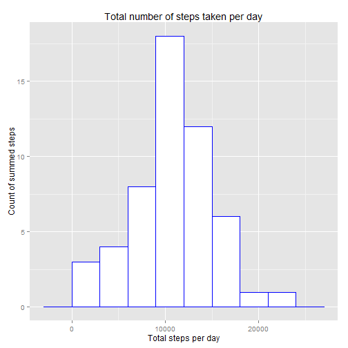
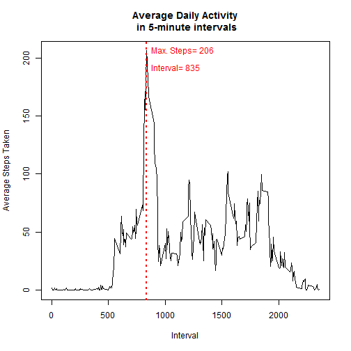

##Introduction
Personal activity monitoring devices allow users to collect a large amount of data about themselves. In this report, we will analyze of set of such data.  
The data used in this report was obtained <a href="<https://d396qusza40orc.cloudfront.net/repdata%2Fdata%2Factivity.zip">here (link is to zip file).</a>  


##Load and Process Data 
First, we need to load and read in the data. We can see that the data consists of three variables, "steps", "date", and "interval".  

* Steps: Number of steps taking in a 5-minute interval (missing values are coded as NA)  
* date: The date on which the measurement was taken in YYYY-MM-DD format  
* interval: Identifier for the 5-minute interval in which measurement was taken  

In addition, we will do a few pre-processing steps -- which will create dataframes that summarize the daily steps by date, and also by interval (time of day).


```r
fileurl="http://d396qusza40orc.cloudfront.net/repdata%2Fdata%2Factivity.zip"
download.file(fileurl, destfile="activity.zip")
#This is the main data
activity <- read.csv(unz("activity.zip","activity.csv"))
head(activity) 
```

```
##   steps       date interval
## 1    NA 2012-10-01        0
## 2    NA 2012-10-01        5
## 3    NA 2012-10-01       10
## 4    NA 2012-10-01       15
## 5    NA 2012-10-01       20
## 6    NA 2012-10-01       25
```

```r
#New dataframe by day 
bydate <- group_by(activity, date) 
stepsbydate <- summarize(bydate, sum(steps))
colnames(stepsbydate) <- c("date", "steps")
#New dataframe by interval
byint <- group_by(activity, interval) 
intstepsmean <-summarize(byint, mean(steps, na.rm=TRUE))
colnames(intstepsmean) <- c("interval", "meansteps")
```

##What is mean total number of steps taken per day? 
Using a simple histogram, we get an idea of the average daily total steps. As shown below, the mean and median number of steps are both around 10,700. 


```r
#calculate mean and median
mean <- mean(stepsbydate$steps, na.rm=TRUE)
median <- median(stepsbydate$steps, na.rm=TRUE)
#plot with lines and text to report mean and median
hist(stepsbydate$steps, breaks=5, main="Total Steps per day", xlab="Total Daily Steps", col="red")
abline(v=mean, lty=2, col="black")
abline(v=median, lty=4, col="blue")
text(mean, 24, labels=paste0("mean=",signif(mean, digits=7)), pos=4, col="black")
text(median, 22, labels=paste0("median=",signif(median, digits=7)), pos=4, col="blue")
```

 

##What is the average daily activity pattern?
Earlier, a dataframe reporting average steps by each 5-min interval was created, so we can use that dataframe to make a line plot of activity at each 5-minute interval, averaged over all days. In the dataset, the 5-minute intervals are identified by an index from 0 to 2355.  
We also want to answer the question **"Which 5-minute interval, on average across all the days in the dataset, contains the maximum number of steps?"**  
The answer to this, as shown in the plot, is 206 steps (rounded to the nearest integer). The interval that corresponds to the max steps is "835", or 8:35-8:40 AM. 


```r
#calculate maximum avg. steps and its matching interval
maxint<-intstepsmean$interval[which.max(intstepsmean$meansteps)]
maxstep<-max(intstepsmean$meansteps)
plot(intstepsmean, type="l", 
     main="Average Daily Activity\n in 5-minute intervals",
     xlab="Interval",
     ylab="Average Steps Taken"
     )
abline(v=maxint, lty=3, lwd=2, col="red")
text(maxint, maxstep, labels=paste("Max. Steps=", as.character(round(maxstep))), col="red", pos=4)
text(maxint, maxstep-15 , labels=paste("Interval=", as.character(maxint)), col="red", pos=4)
```

 

