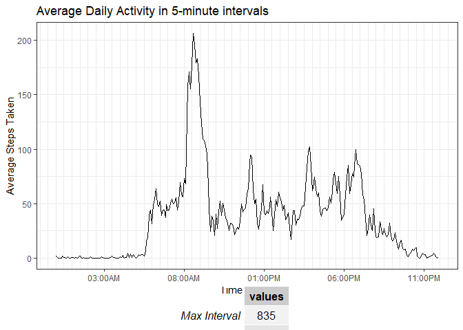
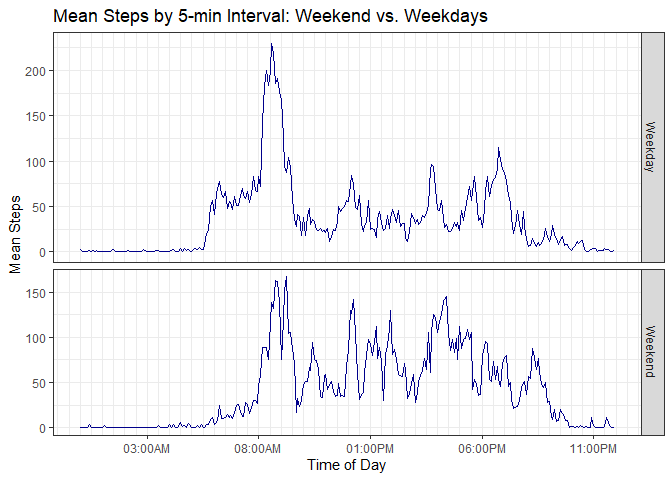

##Introduction
Personal activity monitoring devices allow users to collect a large amount of data about themselves. In this report, we will analyze of set of such data.  
The data used in this report was obtained [here](https://d396qusza40orc.cloudfront.net/repdata%2Fdata%2Factivity.zip) (link is to zip file).

Setup steps and packages used:

```r
setwd("~/data")
rm(list = ls())
library(dplyr)
library(ggplot2)
library(reshape2)
library(gridExtra)
```


##Load and Process Data 
First, we need to load and read in the data. We can see that the data consists of three variables, "steps", "date", and "interval".  

* Steps: Number of steps taking in a 5-minute interval (missing values are coded as NA)  
* date: The date on which the measurement was taken in YYYY-MM-DD format  
* interval: Identifier for the 5-minute interval in which measurement was taken  

In addition, we will do a few pre-processing steps -- which will create dataframes that summarize the daily steps by date, and also by interval (time of day).


```r
fileurl="http://d396qusza40orc.cloudfront.net/repdata%2Fdata%2Factivity.zip"
filename <- "activity.zip"
if (file.exists(filename)) {
  print("File present!")
  } else {download.file(fileurl, destfile="activity.zip")}
```

```
## [1] "File present!"
```

```r
#This is the main data
activity <- read.csv(unz("activity.zip","activity.csv"))
head(activity) 
```

```
##   steps       date interval
## 1    NA 2012-10-01        0
## 2    NA 2012-10-01        5
## 3    NA 2012-10-01       10
## 4    NA 2012-10-01       15
## 5    NA 2012-10-01       20
## 6    NA 2012-10-01       25
```

```r
#For now, remove NA's
act_clean <- activity[!is.na(activity$steps),]
#Agrregated dataframes by day and by interval
bydate <- act_clean %>%
          group_by(date) %>%
          summarize(steps=sum(steps))
byint <- act_clean %>%
          group_by(interval) %>%
          summarize(steps=mean(steps))
```

##What is mean total number of steps taken per day? 
Using a simple histogram, we get an idea of the average daily total steps.  


```r
means <- data.frame(Mean=signif(mean(bydate$steps), digits=7), Median=signif(median(bydate$steps), digits=7))
plot <- ggplot(data=bydate, aes(bydate$steps))
plot1 <- plot + geom_histogram(stat="bin", binwidth=max(bydate$steps)/10,color="blue", fill="white")
plot1 <- plot1 + 
  labs(title="Total number of steps taken per day", x="Total steps per day", y="Count of summed steps") + 
  geom_vline(xintercept=mean(bydate$steps), color="blue", lty=2) + 
  geom_vline(xintercept=median(bydate$steps),color="red", lty=5) + 
  annotation_custom(tableGrob(means), xmin=15000, xmax=25000, ymin=8, ymax=15)
plot1
```

 

##What is the average daily activity pattern?
Earlier, a dataframe reporting average steps by each 5-min interval was created, so we can use that dataframe to make a line plot of activity at each 5-minute interval, averaged over all days. In the dataset, the 5-minute intervals are identified by an index from 0 to 2355.


```r
#calculate maximum avg. steps and its matching interval
maxint<-byint$interval[which.max(byint$steps)]
maxstep<-max(byint$steps)
maxes <- data.frame(MaxInterval=maxint, MaxSteps=round(maxstep))
plot2 <- ggplot(data=byint, aes(x=interval, y=steps))
plot2 <- plot2 + geom_line() +
  labs(title="Average Daily Activity\n in 5-minute intervals",
     x="Interval",
     y="Average Steps Taken") +
  geom_vline(xintercept=maxint) +
  annotation_custom(tableGrob(maxes), xmin=1500, xmax=2000, ymin=125, ymax=150)
plot2
```

 


##Imputing missing values
The original dataset had a missing values, signified by "NA", which we initially ignored. First we figure out how many missing values there are.

There are 2304 missing values, and 15264 complete cases in the original dataset. To fill in this data, we can use the average values from each 5-minute interval. We could have also used the daily average, but since the previous plot showed that there is a lot of variation by time of day, it seems "safer" to use the average at each 5-min interval.

To do this, we go back to the original dataset. We also use the interval means dataset (`byint`) created for the second plot, which provides us the mean interval values to substitute in at each missing datapoint.


```r
act2<-activity
for (i in 1:nrow(act2)) {
    if (is.na(act2$steps[i])) {
        act2$steps[i] <- byint[which(act2$interval[i] == byint$interval), ]$steps
    }
}
sum(is.na(act2)) #check that there's no more NAs
```

```
## [1] 0
```

```r
head(act2)
```

```
##       steps       date interval
## 1 1.7169811 2012-10-01        0
## 2 0.3396226 2012-10-01        5
## 3 0.1320755 2012-10-01       10
## 4 0.1509434 2012-10-01       15
## 5 0.0754717 2012-10-01       20
## 6 2.0943396 2012-10-01       25
```

**Did the data change by our "impute" procedure?**
To look at the effect of [fill in]


```r
bydate2 <- act2 %>% 
        group_by(date) %>%
        summarize(steps=sum(steps)) 
plot <- ggplot(data=bydate2, aes(bydate2$steps))
plot4 <- plot + geom_histogram(stat="bin",
                               binwidth=max(bydate$steps)/10,
                               color="blue", 
                               fill="white")
plot4 <- plot4 + labs(title="Total number of steps taken per day",
                      x="Total steps per day",
                      y="Count of summed steps")
plot4
```

 

```r
means <- data.frame(Mean=mean(bydate$steps), Median=median(bydate$steps), Mean_new=mean(bydate2$steps), Median_new=median(bydate2$steps))
print(means)
```

```
##       Mean Median Mean_new Median_new
## 1 10766.19  10765 10766.19   10766.19
```

The mean and median have not changed much by "imputing" the missing data. The main effect of the imputation is that the frequencies at each histogram bin has increased. 

##Are there differences in activity patterns between weekdays and weekends?


```r
#change date format in dataset
act2$date <- as.Date(strptime(act2$date, format="%Y-%m-%d"))
#create a "day of week" variable
act2$dow <- weekdays(act2$date)
#Subset the data into Weekend and Weekday, and replace day of week 
wkend <- act2 %>% subset(dow %in% c("Saturday", "Sunday")) %>% mutate(dow2="Weekend")
wkday <- act2 %>% 
        subset(!dow %in% c("Saturday", "Sunday")) %>%
        mutate(dow2="Weekday")
#combine the two sets
act3 <- rbind(wkday, wkend)    
#get aggregate dataset for plot
act4 <- act3 %>%
        group_by(interval, dow2) %>%
        summarize(steps=mean(steps))
plot <- ggplot(act4, aes(x=interval, y=steps)) + 
  geom_line(color="dark green", type="l") + 
  facet_grid(dow2~., scales="free", space="free")
plot <- plot + 
  labs(x="Interval", 
       y="Mean Steps", 
       title="Mean Steps by 5-min Interval\n Weekend vs. Weekdays") 
print(plot)
```

 

From this plot, we see that our anonymous walker walks more during weekends, but each weekday, there is a lot of walking right near the interval at 830 (which we sort of knew from before). The final graph gives us a clue as to the overall walking pattern: More walking on weekends, but on weekdays, our person does a lot of walking around ~8:30AM. This pattern fits with a person who maybe walks to work everyday, and then takes a lot of walks on weekend days. 


