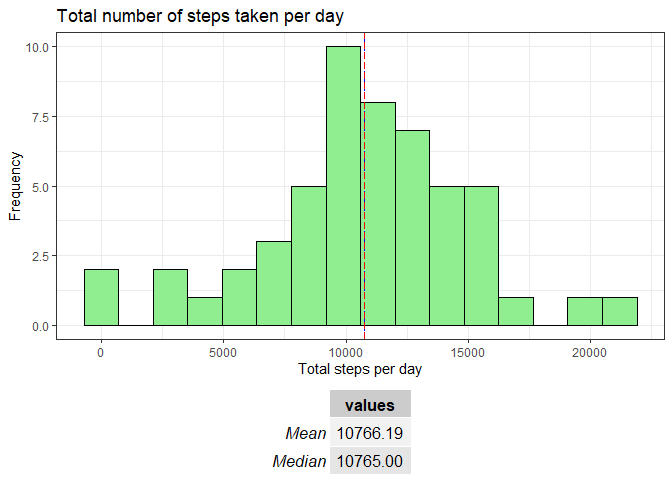
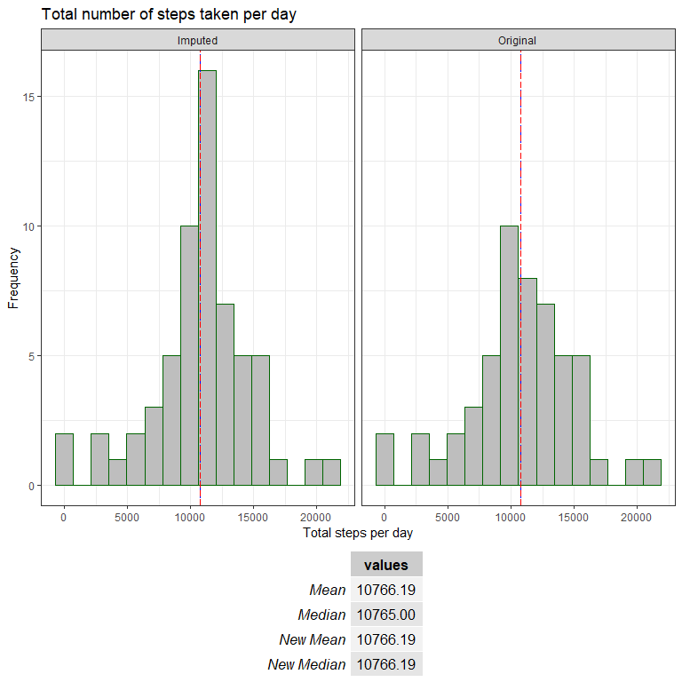
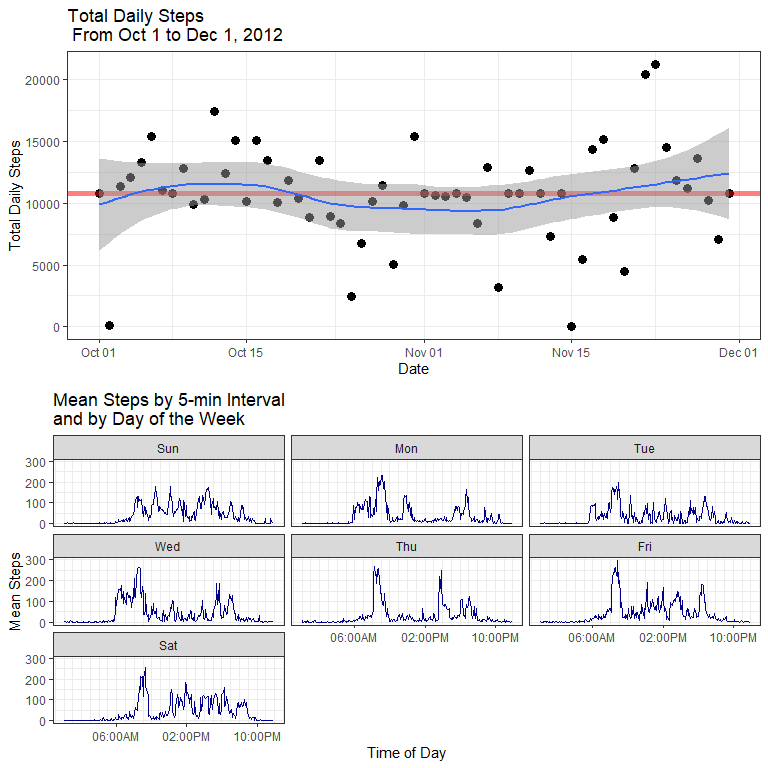

##Introduction  

  Personal activity monitoring devices allow individuals to collect a large amount of data about their activities. These devices iclude "[fitness bands](https://www.google.com/search?q=fitness+bands)" like Fitbit ad Jawbone. Smartphone apps that use the phone's own motion processor or sensors provide [a cheaper but possibly less accurate alterative](http://www.wired.com/2014/01/smartphone-fitness-tracker/). Regardless of the device used, many individuals are collecting data about their daily activity as part of a growing ["Quantified Self"](http://en.wikipedia.org/wiki/Quantified_Self) movement. Often, the fitness device comes with software for basic analyses.  
  This report provides methods for processing and analyzing such fitness data, and may be beneficial as an example for people who find these pre-packagd analyses limited or wish to connect their data to their own personal applications. The data used in this report was obtained [here](https://d396qusza40orc.cloudfront.net/repdata%2Fdata%2Factivity.zip).

Setup steps and packages used:

```r
setwd("~/data")
rm(list = ls())
library(dplyr)
library(ggplot2)
library(scales)
library(gridExtra)
library(lubridate)
library(knitr)
opts_chunk$set(cache=TRUE, echo=TRUE)
```


##Load and Process Data  

  The data consists the following variables:  

* Steps: Number of steps taking in a 5-minute interval (missing values are coded as NA)  
* date: The date on which the measurement was taken in YYYY-MM-DD format.
* interval: Identifier for the 5-minute interval in which measurement was taken.
+This interval is given as a numeric value from 0 to 2355, representing five-minute segments (i.e 830=8:30 AM, while 2200=10 PM).  

  We first create summary datasets of the total steps per day, and the daily activity pattern. The two generated dataframes are:  

  * bydate: Summed steps by day
  * byint: average steps at each 5-min interval, averaged over all days 
    + An additional formatting step to create a "variable for the time interval


```r
fileurl="http://d396qusza40orc.cloudfront.net/repdata%2Fdata%2Factivity.zip"
filename <- "activity.zip"
if (!file.exists(filename)) {
    download.file(fileurl, destfile="activity.zip")} 
#This is the main data
activity <- read.csv(unz("activity.zip","activity.csv"))
head(activity) 
```

```
##   steps       date interval
## 1    NA 2012-10-01        0
## 2    NA 2012-10-01        5
## 3    NA 2012-10-01       10
## 4    NA 2012-10-01       15
## 5    NA 2012-10-01       20
## 6    NA 2012-10-01       25
```

```r
#For now, remove NA's
act_clean <- activity[!is.na(activity$steps),]
#Agrregated dataframes by day and by interval
bydate <- act_clean %>%
          group_by(date) %>%
          summarize(steps=sum(steps)) 
      
byint <- act_clean %>%
          group_by(interval) %>%
          summarize(steps=mean(steps))
#creating a as.POSIXct interval datetime variable 
byint_plot <- byint 
byint_plot$timeint<-as.POSIXct(sprintf("%04d",byint_plot$interval), tz="UTC", format="%H%M")
```

##What is mean total number of steps taken per day?  
  To answer the question, we plot a histogram of bydate, which contains the summed steps taken for every day of the dataset. Using the  pacakge [gridExtra](http://cran.r-project.org/web/packages/gridExtra/gridExtra.pdf), we can annotate the plot with the calculated mean and median. 


```r
table1 <- data.frame(Mean=sprintf("%1.3f",mean(bydate$steps)), 
                     Median=sprintf("%1.3f", median(bydate$steps)))

plot <- ggplot(data=bydate, aes(bydate$steps))
plot1 <- plot + geom_histogram(stat="bin", binwidth=max(bydate$steps)/15,color="black", fill="white")
plot1 <- plot1 + 
  labs(title="Total number of steps taken per day", x="Total steps per day", y="Frequency") + 
  geom_vline(xintercept=mean(bydate$steps), color="blue", lty=2) + 
  geom_vline(xintercept=median(bydate$steps),color="red", lty=5) +
  theme_bw()

grid.arrange(plot1, tableGrob(table1), nrow=2, heights=c(1,0.1))
```

 

##What is the average daily activity pattern?

  The dataframe byint contains the average steps at each 5-min interval. Each interval is averaged across all days reported in the data (currently with NAs removed). In the next figure, we plot the average steps against the time interval. The table reports the maximum steps and the associated interval. 


```r
#calculate maximum avg. steps and its matching interval
maxint<-byint$interval[which.max(byint$steps)]
maxstep<-max(byint_plot$steps)
table2 <- data.frame(Most_Active_Interval=maxint, Steps=round(maxstep))

plot2 <- ggplot(data=byint_plot, aes(x=timeint, y=steps))
plot2 <- plot2 + geom_line(color="red") +
  labs(title="Average Daily Activity in 5-minute intervals",
     x="Time of Day (HH:MM)",
     y="Average Steps Taken") + 
  scale_x_datetime(breaks=date_breaks("5 hours"), minor_breaks=date_breaks("30 min"),
                   labels=date_format("%I:%M%p")) +
  theme_bw() +
  theme(axis.text.x = element_text(angle = 45, hjust=1))
grid.arrange(plot2, tableGrob(table2), nrow=2, heights=c(1,0.1))
```

 


##Imputing missing values  

  The original dataset had missing values, signified by "NA", which we initially ignored. The dplyr package can compare two datasets using the join function. We spefically use the anti-join: [it returns all values in x that are not matched in y, and only keeps columns from x.](https://stat545-ubc.github.io/bit001_dplyr-cheatsheet.html). The joined dataset will only contain NA entries, so that we can see which dates contain missing data. Also, the row count can be compared against the original dataset. 


```r
#return na rows with anti_join
bydate_missing <- anti_join(activity, act_clean, by="steps")
days <-distinct(bydate_missing, Missing=as.Date(bydate_missing$date))
#Information on missing Dates
days$Missing
```

```
## [1] "2012-10-01" "2012-10-08" "2012-11-01" "2012-11-04" "2012-11-09"
## [6] "2012-11-10" "2012-11-14" "2012-11-30"
```

```r
data.frame(TotalObs=nrow(activity), CompleteObs=nrow(act_clean), MissingObs=nrow(bydate_missing))
```

```
##   TotalObs CompleteObs MissingObs
## 1    17568       15264       2304
```

  There are 2304 missing rows to impute out of a total 17568, and these missing rows are associated with 8 days out of the 2-month dataset. 
  To fill in these missing time intervals, we can use the average values from each 5-minute interval that was calculated earlier and stored in byint. Essentially, we will assume that on the 8 missing days, our anonymous "Quantified Self"-er had the daily activity pattern shown in the second figure. 


```r
act2<-activity
for (i in 1:nrow(act2)) {
    if (is.na(act2$steps[i])) {
        act2$steps[i] <- byint[which(act2$interval[i] == byint$interval), ]$steps
    }
}
sum(is.na(act2)) #check that there's no more NAs
```

```
## [1] 0
```

**How did imputing data affect the mean and median?**  
  Since we used a mean value to replace missing data, we expect that the overall mean should not be changed much. To test this, we repeat the same process we applied to the original dataset to get a histogram with calculated mean and median. 


```r
bydate2 <- act2 %>% 
        group_by(date) %>%
        summarize(steps=sum(steps)) 
tableN <- data.frame(NewMean=sprintf("%1.3f",mean(bydate2$steps)), NewMedian=sprintf("%1.3f",median(bydate2$steps)))
table3<-cbind(table1, tableN)
                    
plot3 <- ggplot(data=bydate2, aes(steps))
plot3 <- plot3 + geom_histogram(stat="bin", binwidth=max(bydate2$steps)/15,color="dark green", fill="white") + ylim(0,22)
plot3 <- plot3 + 
  labs(title="Total number of steps taken per day (Imputed Data)", x="Total steps per day", y="Frequency") + 
  geom_vline(xintercept=mean(bydate2$steps), color="blue", lty=2) + 
  geom_vline(xintercept=median(bydate2$steps),color="red", lty=5) +
  theme_bw()
#place new histogram next to original histogram, and with same y-axis scale
plot1 <- plot1 + ylim(0,22)
grid.arrange(plot3, plot1, tableGrob(table3), nrow=3, heights=c(1,1,0.25))
```

 

  We can confirm that the mean and median have not changed much in the imputed data. After imputation, the mean and median are closer to each other. We can observe from the histogram that the main effect was to increase the number of counts in the bin that contains the mean and median. 

##Are there differences in activity patterns between weekdays and weekends?


```r
#change date format in dataset
act2$date <- as.Date(strptime(act2$date, format="%Y-%m-%d"))
#create a "day of week" variable
act2$dow <- wday(act2$date, label=TRUE)
#Subset the data into Weekend and Weekday, and replace day of week 
wkend <- act2 %>%
        subset(dow %in% c("Sat", "Sun")) %>%
        mutate(dow2="Weekend")
wkday <- act2 %>% 
        subset(!dow %in% c("Sat", "Sun")) %>%
        mutate(dow2="Weekday")
#combine the two sets
act3 <- rbind(wkday, wkend)    
#get aggregate dataset for plot
act4 <- act3 %>%
        group_by(interval, dow2) %>%
        summarize(steps=mean(steps))
act4plot<-act4
act4plot$timeint<-parse_date_time(paste("2012-10-01",sprintf("%04d",act4$interval)), "Y!m*!d!H!M!")
plot4 <- ggplot(data=act4plot, aes(x=timeint, y=steps)) + 
  geom_line(color="dark blue", type="l", aes(group=dow2)) + 
  facet_grid(dow2~., scales="free", space="free")
plot4 <- plot4 + 
  labs(x="Time of Day", 
       y="Mean Steps", 
       title="Mean Steps by 5-min Interval: Weekend vs. Weekdays") +
  scale_x_datetime(breaks=date_breaks("5 hours"), minor_breaks=date_breaks("30 min"),
                   labels=date_format("%I:%M%p")) +
  theme_bw()
plot4
```

 


  From this plot, we see that on weekends, there are more intervals where the number of steps is >100, which implies that the weekends contain more sustained activity over the day than weekdays. On weekdays, there is a peak of activity in the mornings, around 8-9AM. This pattern fits with a person who takes a walk every weekday morning, or walks to work, and then engages in a lot of activit over the weekend.

##Conclusions  
  Using a downloaded .csv file of activity data as the input we can use R, Markdown and Knitr to create a customized analysis output from any giving dataset, which we can then use for several applications. For example, one can generate reports of activity levels as a way to track oneself to a healthier lifestyle. 
  
##Appendix: Additional plots which may be of interest  
  Here's two additional plots that I also made while playing around with this data. In the first one, I plotted the daily steps against the date, and made a very crude attempt at finding a trend in the data. The second plot is just an "expanded" version of the weekend vs. weekday plot.  


```r
act5 <- act3 %>%
  group_by(date,dow) %>%
  summarize(steps=sum(steps))
plotX <- ggplot(act5, aes(x=ymd(date),y=steps)) + 
  geom_point(size=3) + 
  geom_hline(yintercept=mean(act5$steps), color="red", lty=1, lwd=2, alpha=0.5) +
  stat_smooth(method="loess")
plotX <- plotX + labs(title="Total Daily Steps\n From Oct 1 to Dec 1, 2012", 
                      x="Date", y="Total Daily Steps") +
  theme_bw()

act6 <- act3 %>%
        group_by(interval, dow) %>%
        summarize(steps=mean(steps))
act6plot<-act6
act6plot$timeint<-parse_date_time(paste("2012-10-01",sprintf("%04d",act6plot$interval)), "Y!m*!d!H!M!")
plotY <- ggplot(data=act6plot, aes(x=timeint, y=steps)) + 
  geom_line(color="dark blue", type="l", aes(group=dow)) + 
  facet_wrap(~ dow)
plotY <- plotY + 
  labs(x="Time of Day", 
       y="Mean Steps", 
       title="Mean Steps by 5-min Interval\nand by Day of the Week") +
  scale_x_datetime(breaks=date_breaks("8 hours"), minor_breaks=date_breaks("1 hour"),
                   labels=date_format("%I:%M%p")) +
  theme_bw()
grid.arrange(plotX, plotY, nrow=2)
```

 

